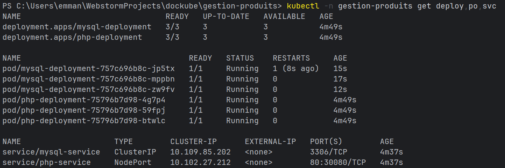

# PARTIE 2 - Orchestration avec Kubernetes

## 📋 Vue d'ensemble

Cette partie décrit le déploiement et l'orchestration de l'application "Gestion Produits" sur un cluster Kubernetes (local avec Minikube ou distant). Elle couvre les fichiers `Deployment.yaml` et `Service.yaml`, le stockage persistant, la scalabilité et les commandes pour relancer le projet depuis votre côté.

## ✅ Plan et checklist

- [x] Présenter la structure des fichiers Kubernetes
- [x] Expliquer `Deployment.yaml` (MySQL + PHP, PV/PVC, Namespace)
- [x] Expliquer `Service.yaml` (exposition NodePort/ClusterIP)
- [x] Fournir les commandes pour créer le cluster, déployer, scaler et tester le load balancing
- [x] Indiquer les étapes pour relancer le projet (rebuild des images, redeploy)
- [x] Ajouter capture d'écran de preuve (référence à `md-images/scalable-screen.png`)

---

## 🗂️ Structure du projet pour Kubernetes

```
gestion-produits/
├── Deployment.yaml      # Deployments + PV/PVC + Namespace
├── Service.yaml         # Services (ClusterIP, NodePort)
├── md-images/
│   └── scalable-screen.png  # Capture prouvant que le service est scalable
├── docker-compose.yml   # (Partie 1, utile pour local/dev)
└── .env                 # Variables locales (optionnel pour K8s, préférer Secrets)
```

> Remarque : Pour Kubernetes, on préfère stocker les secrets (mots de passe DB) dans des `Secrets` Kubernetes plutôt que dans `.env`.

## ☸️ Fichier `Deployment.yaml` (emplacement : `./Deployment.yaml`)

## ☸️ Fichier `Service.yaml` (emplacement : `./Service.yaml`)

Séparer les services dans `Service.yaml` : MySQL en `ClusterIP`, PHP en `NodePort` (ou `LoadBalancer` si cloud).

## 🚀 Commandes importantes (création, déploiement, accès, scalabilité)

### 1) Préparer et démarrer Minikube

```bash
# Démarrer minikube
minikube start --driver=docker

# Vérifier le contexte
kubectl config current-context
kubectl get nodes
```

### 2) Déployer les ressources

```bash
kubectl apply -f Deployment.yaml
kubectl apply -f Service.yaml
```

### 5) Vérifications post-déploiement

```bash
kubectl get all -n gestion-produits
kubectl get pv,pvc -n gestion-produits
kubectl describe deployment php-deployment -n gestion-produits
kubectl describe deployment mysql-deployment -n gestion-produits
```

### 6) Accéder à l'application

```bash
# Ouvre le navigateur vers le service (Minikube)
minikube service php-service -n gestion-produits

# Ou obtenir juste l'URL
minikube service php-service -n gestion-produits --url

```

### 7) Tester le load balancing

```bash
# Récupérer les endpoints
kubectl get endpoints php-service -n gestion-produits
# Puis appeler l'URL plusieurs fois; les logs des pods montreront la répartition
kubectl logs -l app=php -n gestion-produits --tail=50
```
## 🖼 Preuve visuelle / capture d'écran




## 📄 Livrables attendus

- ✅ `Deployment.yaml` (existant dans le dépôt)
- ✅ `Service.yaml` (existant dans le dépôt)
- ✅ Capture d'écran `md-images/scalable-screen.png` prouvant la scalabilité


